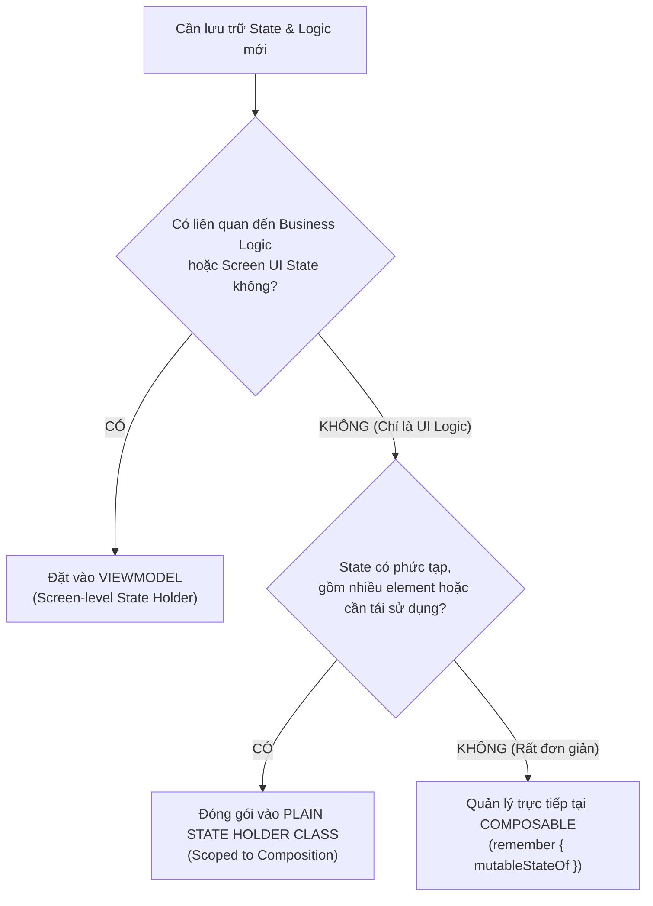

# Bài 02 — Phân Cấp State & State Holders: UI Element State, Screen UI State & Decision Tree

> **Tài liệu tham chiếu chính thức:** [Where to hoist state & State holders — Android Developers](https://developer.android.com/develop/ui/compose/state-hoisting)  
> **Phiên bản áp dụng:** Kotlin 2.0+, Compose BOM 2024.06+, Lifecycle 2.8+  
> **Ngôn ngữ:** Tiếng Việt chuyên ngành (bảo lưu thuật ngữ quốc tế chuẩn trong ngoặc đơn)

---

## 1. Định nghĩa & Thuật ngữ chuẩn (Definition)

Để xây dựng một kiến trúc giao diện mở rộng và dễ bảo trì trong Jetpack Compose, Google chia tách rõ ràng giữa hai loại **State** và hai loại **Logic**:

### 1.1 Hai loại State trong ứng dụng Android
1. **UI Element State (Trạng thái phần tử giao diện):** Là trạng thái cục bộ của các thành phần đồ họa trên màn hình. Nó chỉ phục vụ mục đích hiển thị trực quan (ví dụ: `DrawerState` mở hay đóng, vị trí cuộn `LazyListState`, nội dung đang gõ trong `TextField`, trạng thái hiển thị Dialog).
2. **Screen UI State (Trạng thái giao diện toàn màn hình):** Là dữ liệu phản ánh toàn bộ nội dung cần hiển thị của một màn hình hoàn chỉnh, thường được tổng hợp từ dữ liệu nghiệp vụ (ví dụ: danh sách đơn hàng đã tải từ DB, thông tin người dùng đăng nhập, trạng thái Loading/Error khi gọi API).

### 1.2 Hai loại Logic
1. **UI Logic (Logic giao diện):** Là quy tắc điều hướng hiển thị trực quan thuần túy (ví dụ: cuộn danh sách lên đầu khi nhấn nút, hiển thị Snackbar thông báo, chuyển tab, mở ngăn kéo Drawer). Logic này hoàn toàn độc lập với quy tắc nghiệp vụ kinh doanh.
2. **Business Logic (Logic nghiệp vụ):** Là các quy tắc cốt lõi của ứng dụng (ví dụ: kiểm tra tính hợp lệ của email thanh toán, lưu đơn hàng vào giỏ, trừ điểm thưởng, gọi API xác thực).

### 1.3 Khái niệm State Holder
**State Holder** là một lớp hoặc cấu trúc có nhiệm vụ đóng gói, quản lý và điều phối State cùng các hành vi tương ứng:
- **Plain State Holder class:** Một lớp Kotlin thuần túy (POJO) chịu trách nhiệm quản lý **UI Element State** phức tạp và **UI Logic**.
- **Architecture Components `ViewModel`:** Lớp quản lý **Screen UI State** và điều phối **Business Logic**, có khả năng sống sót qua các sự kiện thay đổi cấu hình (Configuration Changes).

---

## 2. Bản chất & Cơ chế hoạt động (Under the Hood)

### 2.1 So sánh vòng đời & Vị trí lưu trữ trong bộ nhớ

```
┌─────────────────────────┬───────────────────────────────┬──────────────────────────────────┐
│ Tiêu chí                │ Plain State Holder Class      │ Architecture Component ViewModel │
├─────────────────────────┼───────────────────────────────┼──────────────────────────────────┤
│ **Vị trí lưu trữ**      │ Slot Table của Composition    │ ViewModelStore (NonConfig RAM)   │
│ **Phạm vi vòng đời**    │ Phụ thuộc Composition Tree    │ Gắn liền Activity / Navigation   │
│                         │ (Mất khi Composable bị hủy)   │ Destination (NavBackStackEntry)  │
│ **Sống qua Xoay màn hình**│ ❌ Không (trừ khi dùng kèm   │ ✅ Có (Mặc định được giữ lại)    │
│                         │    rememberSaveable)          │                                  │
│ **Sống qua Process Death**│ ❌ Không (trừ khi kết hợp     │ ✅ Có (thông qua SavedStateHandle)│
│                         │    SavedStateRegistry)        │                                  │
│ **Phụ thuộc Android UI**│ Có thể giữ Context, Coroutine │ ❌ CẤM giữ View, Context, Composable│
│                         │ Scope cục bộ của Composable   │ types (tránh Memory Leak nặng)   │
└─────────────────────────┴───────────────────────────────┴──────────────────────────────────┘
```

- **Plain State Holder** được khởi tạo bằng hàm `@Composable rememberMyAppState()` và nằm bên trong bộ nhớ của Composition. Khi một màn hình hoặc widget rời khỏi giao diện, Plain State Holder sẽ tự động bị Garbage Collector dọn dẹp.
- **ViewModel** nằm trong `ViewModelStoreOwner`. Khi người dùng xoay màn hình (Activity bị hủy và tạo lại), Composition bị hủy hoàn toàn, nhưng `ViewModel` vẫn được giữ nguyên trong bộ nhớ nhờ cơ chế `NonConfigurationInstances` của Android Framework.

---

## 3. Bài toán & Kiến trúc (Problem Statement & Architecture)

### 3.1 Hai Anti-patterns kinh điển khi quản lý State

```
      ANTI-PATTERN 1: "GOD VIEWMODEL"                 ANTI-PATTERN 2: "BLOATED COMPOSABLE"
┌─────────────────────────────────────────┐     ┌─────────────────────────────────────────┐
│              ViewModel                  │     │              @Composable                │
│ ❌ Quản lý LazyListState                 │     │ ❌ Chứa 20 biến remember                │
│ ❌ Quản lý DrawerState                   │     │ ❌ Gọi API, validation nghiệp vụ       │
│ ❌ Điều khiển hiển thị bàn phím ảo     │     │ ❌ Tính toán logic giỏ hàng phức tạp     │
│ ❌ Nhận Android Context                 │     │ ❌ Không thể Unit Test giao diện         │
└─────────────────────────────────────────┘     └─────────────────────────────────────────┘
```

1. **God ViewModel (ViewModel ôm đồm mọi thứ):** Nhét cả trạng thái cuộn, trạng thái Drawer, hoạt ảnh vào ViewModel. Điều này vi phạm tính độc lập: ViewModel bị phụ thuộc vào các thư viện UI Compose, làm chậm tốc độ Unit Test và dễ gây rò rỉ bộ nhớ.
2. **Bloated Composable (Composable quá tải):** Viết hàng tá biến `remember`, mã nguồn xử lý tương tác dài hàng trăm dòng trực tiếp trong hàm `@Composable`. Giao diện trở nên rối rắm, khó đọc và bất khả thi khi viết Unit Test.

### 3.2 Cây quyết định chuẩn từ Google (Decision Tree)

Để biết chính xác nên đặt State và Logic ở đâu, hãy đi theo cây quyết định sau:



### 3.3 Sơ đồ Phân cấp State Holders (State Holders Hierarchy)

Trong một ứng dụng Compose hoàn chỉnh, các State Holders không nằm ngang hàng mà tuân theo một hệ phân cấp nghiêm ngặt từ dưới lên trên:

```
┌─────────────────────────────────────────────────────────────┐
│ DATA / BUSINESS LAYER (Repositories, Use Cases, DataSources)│
└──────────────────────────────▲──────────────────────────────┘
                               │ Phụ thuộc (Dependency)
┌──────────────────────────────┴──────────────────────────────┐
│ SCREEN-LEVEL STATE HOLDER (ViewModel)                       │
│ - Điều phối Business Logic                                  │
│ - Xuất ra: StateFlow<ScreenUiState>                         │
│ - Sống sót qua: Xoay màn hình (Configuration Changes)       │
└──────────────────────────────▲──────────────────────────────┘
                               │ Phụ thuộc (Screen Composable đọc StateFlow)
┌──────────────────────────────┴──────────────────────────────┐
│ SCREEN COMPOSABLE                                           │
│ - Kết nối ScreenUiState từ ViewModel tới giao diện          │
│ - Khởi tạo Plain State Holder qua rememberMyAppState()      │
└──────────────────────────────▲──────────────────────────────┘
                               │ Phụ thuộc (Điều phối các phần tử UI)
┌──────────────────────────────┴──────────────────────────────┐
│ PLAIN STATE HOLDER CLASS (MyAppState, LazyListState)        │
│ - Quản lý UI Element State & UI Logic phức tạp              │
│ - Scoped to Composition (sống trong Slot Table)             │
└──────────────────────────────▲──────────────────────────────┘
                               │
┌──────────────────────────────┴──────────────────────────────┐
│ STATELESS COMPOSABLES (Buttons, Cards, ListItems, TextFields)│
│ - Nhận dữ liệu thô (value: T)                               │
│ - Báo cáo tương tác qua lambda callbacks: (T) -> Unit       │
└─────────────────────────────────────────────────────────────┘
```

> [!IMPORTANT]
> **Chiều phụ thuộc là MỘT CHIỀU (Unidirectional Dependency):**
> - Composable phụ thuộc vào State Holder.
> - Plain State Holder KHÔNG BAO GIỜ phụ thuộc vào ViewModel.
> - ViewModel KHÔNG BAO GIỜ biết đến Composable hay Plain State Holder!

---

## 4. Thực hành tốt nhất & Cảnh báo (Best Practices & Anti-patterns)

### 4.1 Bảng phân định trách nhiệm 3 tầng (Separation of Concerns)

| Thành phần | Trách nhiệm chính | Ví dụ điển hình |
| :--- | :--- | :--- |
| **Composable** | Nhận State, phát Event, hiển thị UI thuần túy. Nếu state cực kỳ đơn giản (1 cờ boolean bật tắt), giữ trực tiếp tại đây. | `var isExpanded by remember { mutableStateOf(false) }` |
| **Plain State Holder** | Đóng gói nhiều UI Element States liên kết chặt chẽ với nhau, điều phối logic giao diện (UI Logic). | `class MyAppState(val scaffoldState, val navController, val coroutineScope)` |
| **ViewModel** | Gọi UseCase/Repository, quản lý Business Logic, chuyển đổi Data Stream thành `StateFlow<ScreenUiState>`. | `class CheckoutViewModel(val getCartUseCase, val checkoutUseCase): ViewModel()` |

### 4.2 Quy tắc vàng khi thiết kế Plain State Holder

> [!TIP]
> 1. Luôn đi kèm một hàm tiện ích `@Composable fun remember...State()` để khởi tạo và lưu giữ đối tượng bằng `remember`.
> 2. Nếu Plain State Holder cần CoroutineScope để chạy UI animation (như cuộn danh sách hoặc mở Drawer), hãy inject `rememberCoroutineScope()` từ Composable vào hàm khởi tạo.
> 3. Không bao giờ biến Plain State Holder thành một Singleton — nó phải có vòng đời gắn liền với Composable gọi nó.

### 4.3 Tại sao tuyệt đối KHÔNG truyền ViewModel xuống Composable con?

Một lỗi kiến trúc rất phổ biến của lập trình viên mới là truyền thẳng đối tượng `ViewModel` xuống các widget con sâu trong cây giao diện (ví dụ: `ProductItem(item, viewModel)`).

**3 Tác hại chí mạng của việc truyền ViewModel xuống con:**
1. **Phá hủy khả năng Tái sử dụng (Coupling):** Composable con bị gắn chặt vào một ViewModel cụ thể, không thể tái sử dụng ở màn hình khác.
2. **Không thể viết Preview:** Android Studio `@Preview` không thể khởi tạo được `ViewModel` (vốn đòi hỏi ViewModelProviderFactory, Android Context, Hilt DI).
3. **Cực kỳ khó viết Unit Test:** Để test một nút bấm đơn giản, bạn buộc phải mock toàn bộ ViewModel đồ sộ.

**Giải pháp chuẩn từ Google:**
- Chỉ inject `ViewModel` ở tầng **Screen Composable cao nhất** (nơi định tuyến Navigation).
- Sau đó, phân rã các thuộc tính dữ liệu và truyền xuống con dưới dạng **giá trị thuần (primitive/data class)** và **sự kiện lambda (`onClick = { viewModel.doAction() }`)**.

---

## 5. Mã nguồn Thực tế (Implementation)

Dưới đây là kiến trúc chuẩn mực kết hợp giữa **Plain State Holder** (quản lý UI Logic của Scaffold, Drawer, Snackbar) và **ViewModel** (quản lý dữ liệu danh sách sản phẩm và giỏ hàng).

### 5.1 Plain State Holder: Đóng gói UI Logic

```kotlin
package com.example.compose.state.holders

import androidx.compose.material3.DrawerState
import androidx.compose.material3.DrawerValue
import androidx.compose.material3.SnackbarHostState
import androidx.compose.material3.rememberDrawerState
import androidx.compose.runtime.*
import kotlinx.coroutines.CoroutineScope
import kotlinx.coroutines.launch

/**
 * Plain State Holder class: Quản lý UI logic và các phần tử UI của ứng dụng.
 */
class MyAppState(
    val drawerState: DrawerState,
    val snackbarHostState: SnackbarHostState,
    private val coroutineScope: CoroutineScope
) {
    // Thuộc tính phái sinh biểu diễn trạng thái UI
    val isDrawerOpen: Boolean
        get() = drawerState.isOpen

    // UI Logic: Mở ngăn kéo
    fun openDrawer() {
        coroutineScope.launch {
            drawerState.open()
        }
    }

    // UI Logic: Đóng ngăn kéo
    fun closeDrawer() {
        coroutineScope.launch {
            drawerState.close()
        }
    }

    // UI Logic: Hiển thị thông báo Snackbar
    fun showSnackbar(message: String, actionLabel: String? = null) {
        coroutineScope.launch {
            snackbarHostState.showSnackbar(
                message = message,
                actionLabel = actionLabel
            )
        }
    }
}

/**
 * Factory function khởi tạo và ghi nhớ MyAppState trong Composition.
 */
@Composable
fun rememberMyAppState(
    drawerState: DrawerState = rememberDrawerState(initialValue = DrawerValue.Closed),
    snackbarHostState: SnackbarHostState = remember { SnackbarHostState() },
    coroutineScope: CoroutineScope = rememberCoroutineScope()
): MyAppState {
    return remember(drawerState, snackbarHostState, coroutineScope) {
        MyAppState(
            drawerState = drawerState,
            snackbarHostState = snackbarHostState,
            coroutineScope = coroutineScope
        )
    }
}
```

### 5.2 Screen ViewModel: Quản lý Business Logic & Screen State

```kotlin
package com.example.compose.state.holders

import androidx.lifecycle.ViewModel
import androidx.lifecycle.viewModelScope
import kotlinx.coroutines.flow.MutableStateFlow
import kotlinx.coroutines.flow.StateFlow
import kotlinx.coroutines.flow.asStateFlow
import kotlinx.coroutines.flow.update
import kotlinx.coroutines.launch

// Screen UI State: Bất biến (Immutable)
sealed interface ProductsUiState {
    data object Loading : ProductsUiState
    data class Success(val products: List<String>) : ProductsUiState
    data class Error(val exception: Throwable) : ProductsUiState
}

class ProductsViewModel : ViewModel() {
    private val _uiState = MutableStateFlow<ProductsUiState>(ProductsUiState.Loading)
    val uiState: StateFlow<ProductsUiState> = _uiState.asStateFlow()

    init {
        loadProducts()
    }

    // Business Logic
    fun loadProducts() {
        viewModelScope.launch {
            _uiState.value = ProductsUiState.Loading
            try {
                // Giả lập lấy dữ liệu từ Repository
                val result = listOf("Pixel 9 Pro", "Galaxy S24 Ultra", "iPhone 16 Pro")
                _uiState.value = ProductsUiState.Success(result)
            } catch (e: Exception) {
                _uiState.value = ProductsUiState.Error(e)
            }
        }
    }

    fun removeProduct(productName: String) {
        val currentState = _uiState.value
        if (currentState is ProductsUiState.Success) {
            _uiState.update {
                currentState.copy(products = currentState.products.filterNot { it == productName })
            }
        }
    }
}
```

### 5.3 Màn hình kết hợp 2 tầng State Holder

```kotlin
package com.example.compose.state.holders

import androidx.compose.foundation.layout.*
import androidx.compose.foundation.lazy.LazyColumn
import androidx.compose.foundation.lazy.items
import androidx.compose.material.icons.Icons
import androidx.compose.material.icons.filled.Delete
import androidx.compose.material.icons.filled.Menu
import androidx.compose.material3.*
import androidx.compose.runtime.Composable
import androidx.compose.runtime.getValue
import androidx.compose.ui.Alignment
import androidx.compose.ui.Modifier
import androidx.compose.ui.unit.dp
import androidx.lifecycle.compose.collectAsStateWithLifecycle

@OptIn(ExperimentalMaterial3Api::class)
@Composable
fun ProductsScreen(
    viewModel: ProductsViewModel,
    // Inject Plain State Holder điều phối UI Logic
    appState: MyAppState = rememberMyAppState()
) {
    // Thu thập Screen UI State an toàn theo vòng đời
    val uiState by viewModel.uiState.collectAsStateWithLifecycle()

    Scaffold(
        snackbarHost = { SnackbarHost(hostState = appState.snackbarHostState) },
        topBar = {
            TopAppBar(
                title = { Text("Danh sách thiết bị") },
                navigationIcon = {
                    IconButton(onClick = { appState.openDrawer() }) {
                        Icon(imageVector = Icons.Default.Menu, contentDescription = "Menu")
                    }
                }
            )
        }
    ) { innerPadding ->
        Box(
            modifier = Modifier
                .fillMaxSize()
                .padding(innerPadding)
        ) {
            when (val state = uiState) {
                is ProductsUiState.Loading -> {
                    CircularProgressIndicator(modifier = Modifier.align(Alignment.Center))
                }
                is ProductsUiState.Error -> {
                    Text(
                        text = "Đã xảy ra lỗi tải dữ liệu!",
                        color = MaterialTheme.colorScheme.error,
                        modifier = Modifier.align(Alignment.Center)
                    )
                }
                is ProductsUiState.Success -> {
                    LazyColumn(modifier = Modifier.fillMaxSize()) {
                        items(state.products, key = { it }) { item ->
                            ListItem(
                                headlineContent = { Text(item) },
                                trailingContent = {
                                    IconButton(onClick = {
                                        viewModel.removeProduct(item)
                                        appState.showSnackbar("Đã xóa $item thành công")
                                    }) {
                                        Icon(Icons.Default.Delete, contentDescription = "Xóa")
                                    }
                                }
                            )
                        }
                    }
                }
            }
        }
    }
}
```

---

## 6. Các câu hỏi thực tế thường gặp & Xử lý sự cố (FAQ & Troubleshooting)

### Q1: Tại sao tuyệt đối KHÔNG ĐƯỢC truyền `NavController` hoặc `Context` vào ViewModel?
- **Nguyên nhân:** `ViewModel` có vòng đời dài hơn `Activity` và các Composable screens khi xảy ra xoay màn hình (Configuration Change).
- Nếu truyền `NavController` hoặc `Context` vào ViewModel, ViewModel sẽ giữ tham chiếu mạnh (strong reference) tới `Activity` hoặc Composition cũ đã bị hủy $\rightarrow$ **Gây ra rò rỉ bộ nhớ (Memory Leak) nghiêm trọng**.
- **Giải pháp chuẩn:** Đưa `NavController` vào Plain State Holder hoặc truyền các hành động điều hướng dưới dạng lambda callback từ UI: `onNavigateToDetails: (String) -> Unit`.

### Q2: Có thể inject Hilt vào một Plain State Holder class được không?
- **Trả lời:** Plain State Holder class là đối tượng được tạo ra và quản lý bên trong Composition (`remember`). Bạn **không thể** dùng `@Inject constructor` trực tiếp thông qua Hilt như một `@HiltViewModel`.
- **Cách xử lý đúng:**
  1. Plain State Holder chỉ nên nhận các dependency thuộc UI layer (như `NavController`, `DrawerState`, `CoroutineScope`).
  2. Nếu cần một service nghiệp vụ, hãy inject service đó vào `ViewModel`, rồi để Composable kết nối kết quả từ ViewModel tới UI.
  3. Trong trường hợp hiếm hoi cần helper class từ Hilt (như `AnalyticsHelper`), hãy `@Inject` nó vào Composable/Activity bằng `@EntryPoint` hoặc truyền qua `CompositionLocal`.

### Q3: Plain State Holder có thể tự viết Unit Test được không?
- **Hoàn toàn có thể và rất dễ dàng!** Đây chính là ưu điểm lớn nhất của mô hình Plain State Holder. Vì nó là một class Kotlin thuần túy (không kế thừa Android Framework), bạn có thể dễ dàng khởi tạo nó trong thư mục `test/`, mock các tham số và viết Unit Test cho toàn bộ logic mở/đóng drawer, định dạng hiển thị mà không cần khởi chạy Android Emulator.
