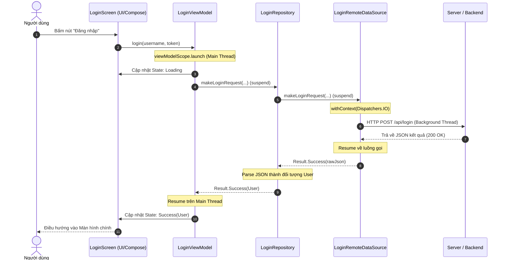

# Bài 01 — Kotlin Coroutines trên Android (Kotlin Coroutines on Android)

> **Tài liệu tham chiếu gốc:** [Kotlin coroutines on Android — Android Developers](https://developer.android.com/kotlin/coroutines?hl=vi)  
> **Áp dụng:** Kotlin 2.0+, `kotlinx.coroutines:1.11.0`, AndroidX Lifecycle 2.8+  
> **Mục tiêu:** Nắm vững bản chất coroutine trong môi trường Android, 4 ưu điểm cốt lõi, quản lý luồng nền (background threads), khái niệm Main-safety với các Dispatchers (`Main`, `IO`, `Default`), và mô hình phân tầng kiến trúc từ ViewModel xuống Data Layer.

---

## 1. Giới thiệu: Tại sao Android cần Coroutines?

Trên nền tảng Android, **luồng chính (Main thread)** đóng vai trò tối quan trọng: chịu trách nhiệm render toàn bộ giao diện người dùng (UI) ở tốc độ 60fps hoặc 120fps (mỗi khung hình chỉ có khoảng 16ms hoặc 8ms để xử lý), đồng thời tiếp nhận mọi sự kiện chạm, vuốt của người dùng.

Nếu bạn thực hiện một thao tác tốn thời gian trên Main thread — chẳng hạn như gọi API qua mạng, đọc/ghi tệp tin trên ổ đĩa, hoặc truy vấn cơ sở dữ liệu lớn — luồng chính sẽ bị **khóa cứng (blocked)**. Hậu quả là ứng dụng bị giật, đứng hình (frozen UI), và sau 5 giây hệ điều hành sẽ kích hoạt hộp thoại **ANR (Application Not Responding)** buộc người dùng phải đóng ứng dụng.

```
Mô hình đe dọa Main Thread:
Main Thread ───[Render Frame]───► [Blocked: Network Request (2s)] ───► [ANR Dialog Triggered!]
                                       ▲
                                       │ Người dùng chạm màn hình nhưng không phản hồi!
```

**Coroutine** là giải pháp bất đồng bộ được Google khuyến nghị chính thức trên Android nhằm giải quyết triệt để vấn đề này, giúp viết code bất đồng bộ tuần tự, dễ đọc và an toàn tuyệt đối.

---

## 2. Bốn Tính Năng Then Chốt của Coroutines trên Android

Google tích hợp sâu Coroutines vào Android nhờ 4 đặc tính vượt trội:

### 2.1. Trọng lượng siêu nhẹ (Lightweight)
Bạn có thể khởi chạy hàng chục nghìn coroutines cùng lúc trên một luồng đơn mà không làm cạn kiệt bộ nhớ hệ thống.
- **Thread của OS:** Mỗi thread Java/Android tiêu tốn xấp xỉ `1MB` bộ nhớ Stack và việc chuyển đổi ngữ cảnh (Context Switching) giữa các thread ở cấp độ nhân hệ điều hành (OS kernel) rất tốn kém CPU.
- **Coroutine:** Tồn tại dưới dạng đối tượng trên Heap (Heap frame) chỉ tốn vài chục bytes. Khi coroutine tạm dừng (`suspend`), nó giải phóng thread hiện tại để thread đó làm việc khác và tiếp tục (`resume`) sau khi dữ liệu đã sẵn sàng mà không cần block thread.

### 2.2. Giảm thiểu rò rỉ bộ nhớ (Fewer Memory Leaks)
Nhờ triết lý **Structured Concurrency (Tính đồng thời có cấu trúc)**:
- Mọi coroutine đều phải được khởi chạy trong một `CoroutineScope` xác định.
- Khi phạm vi đó kết thúc (ví dụ: ViewModel bị hủy khi người dùng thoát màn hình), toàn bộ các coroutine con đang chạy bên trong phạm vi đó sẽ **tự động bị hủy bỏ theo tầng (cascade cancellation)**, ngăn chặn hoàn toàn việc coroutine tiếp tục chạy ngầm gây rò rỉ Activity/Fragment.

### 2.3. Hỗ trợ cơ chế hủy tích hợp (Built-in Cancellation Support)
Việc hủy bỏ một tác vụ đang chạy được truyền tự động dọc theo cây phân cấp công việc (`Job hierarchy`). Khi một coroutine cha bị hủy, tất cả coroutine con bị hủy theo.

### 2.4. Tích hợp sâu vào các thư viện Jetpack (Jetpack Integration)
Các thư viện Android Jetpack hiện đại đều cung cấp sẵn các scope và extension chuyên dụng:
- **Lifecycle & ViewModel:** `viewModelScope`, `lifecycleScope`.
- **Room Database:** Hỗ trợ trực tiếp hàm `suspend` và luồng phản ứng `Flow`.
- **WorkManager:** `CoroutineWorker` để thực thi tác vụ nền đáng tin cậy.

---

## 3. Quản lý Luồng Nền và Khái niệm Main-Safety

### 3.1. Các Bộ điều phối Luồng (Dispatchers)
Kotlin Coroutines sử dụng **Dispatchers** để xác định luồng nào (hoặc nhóm luồng nào) sẽ thực thi coroutine:

| Dispatcher | Luồng thực thi | Trường hợp sử dụng chuẩn trên Android |
| :--- | :--- | :--- |
| **`Dispatchers.Main`** | Main UI Thread | Cập nhật giao diện UI, gọi các hàm `suspend` nhẹ, xử lý sự kiện UI, tương tác với Jetpack Compose/Views. |
| **`Dispatchers.IO`** | Thread Pool mở rộng (tối đa 64 threads hoặc số core) | Các tác vụ vào/ra (I/O) ngoài luồng: Đọc/ghi file, truy vấn Room database, gọi mạng Retrofit/OkHttp, ghi SharedPreferences. |
| **`Dispatchers.Default`** | Thread Pool theo số lõi CPU | Các tác vụ tính toán nặng CPU (CPU-intensive): Sắp xếp danh sách lớn, phân tích chuỗi JSON phức tạp, xử lý ảnh, thuật toán DiffUtil. |

---

### 3.2. Khái niệm Main-Safety (An toàn với Luồng chính)

> [!IMPORTANT]
> **Quy tắc vàng của Google:**  
> Một hàm tạm dừng (`suspend function`) được gọi là **Main-safe** khi nó có thể được gọi an toàn từ `Dispatchers.Main` mà không làm đơ giao diện của người dùng.

Nếu một hàm cần thực hiện tác vụ đọc đĩa hoặc gọi mạng, chính hàm đó phải chịu trách nhiệm chuyển luồng sang `Dispatchers.IO` bằng cách sử dụng toán tử `withContext`:

```kotlin
// Hàm này đảm bảo Main-safe: caller gọi từ Main Thread hoàn toàn yên tâm
suspend fun fetchUserData(): User {
    return withContext(Dispatchers.IO) {
        // Khối mã này chạy an toàn trên background thread của Dispatchers.IO
        apiService.getUser() 
    }
}
```

```
Cơ chế chuyển luồng của withContext:
Main Thread: ──────[viewModelScope.launch]───► (Tạm dừng - Suspend) ──────► [Nhận User & cập nhật UI]
                                                     ▲                          │
                                                     │ resume                   │
IO Thread Pool: ──────────────────────────────[withContext(Dispatchers.IO)]─────┘
                                              Thực thi gọi API trên mạng
```

---

## 4. Khởi chạy Coroutine: `launch` vs `async`

Hai coroutine builder thông dụng nhất trong Android là:

### 4.1. `launch` — Bắn và quên (Fire-and-forget)
Sử dụng khi bạn muốn bắt đầu một tác vụ mới mà không cần trả về kết quả trực tiếp cho caller. `launch` trả về một đối tượng `Job` dùng để theo dõi hoặc hủy coroutine.

```kotlin
// Thường sử dụng trong ViewModel để phản hồi tương tác người dùng
fun onRefreshClicked() {
    viewModelScope.launch {
        showLoadingSpinner()
        repository.refreshData() // suspend function
        hideLoadingSpinner()
    }
}
```

### 4.2. `async` — Tác vụ trả về kết quả (Async / Await)
Sử dụng khi bạn muốn thực hiện tác vụ và lấy lại kết quả trong tương lai. `async` trả về một `Deferred<T>` (tương đương `Future` hoặc `Promise`). Bạn gọi `.await()` trên `Deferred` để nhận giá trị trả về.

```kotlin
suspend fun fetchDashboardData(): Dashboard = coroutineScope {
    // Chạy song song 2 request mạng cùng lúc
    val userDeferred = async { apiService.getUser() }
    val newsDeferred = async { apiService.getLatestNews() }

    // Chờ cả 2 hoàn tất và kết hợp kết quả
    Dashboard(
        user = userDeferred.await(),
        news = newsDeferred.await()
    )
}
```

---

## 5. Phân tích Kiến trúc Mẫu: Luồng Đăng nhập (Login Flow)

Dưới đây là kiến trúc chuẩn 3 tầng được trích xuất trực tiếp từ tài liệu chính thức của Google:
1. **Tầng Trình bày (Presentation Layer):** `LoginViewModel`
2. **Tầng Dữ liệu (Repository Layer):** `LoginRepository`
3. **Tầng Nguồn dữ liệu (Data Source Layer):** `LoginRemoteDataSource`

### 5.1. Tầng Nguồn dữ liệu (`LoginRemoteDataSource`)
Chịu trách nhiệm thực hiện HTTP Request. Thao tác I/O được bao bọc trong `withContext(Dispatchers.IO)` để đảm bảo Main-safe.

```kotlin
sealed class Result<out R> {
    data class Success<out T>(val data: T) : Result<T>()
    data class Error(val exception: Exception) : Result<Nothing>()
}

class LoginRemoteDataSource(
    private val ioDispatcher: CoroutineDispatcher = Dispatchers.IO
) {
    private val loginUrl = "https://example.com/api/login"

    // Hàm suspend này đảm bảo Main-safe
    suspend fun makeLoginRequest(
        jsonBody: String
    ): Result<String> = withContext(ioDispatcher) {
        val url = URL(loginUrl)
        (url.openConnection() as? HttpURLConnection)?.run {
            requestMethod = "POST"
            setRequestProperty("Content-Type", "application/json; utf-8")
            setRequestProperty("Accept", "application/json")
            doOutput = true
            outputStream.write(jsonBody.toByteArray())

            return@withContext if (responseCode == HttpURLConnection.HTTP_OK) {
                val response = inputStream.bufferedReader().use { it.readText() }
                Result.Success(response)
            } else {
                Result.Error(IOException("Lỗi mạng: $responseCode - $responseMessage"))
            }
        }
        return@withContext Result.Error(IOException("Không thể mở kết nối mạng"))
    }
}
```

---

### 5.2. Tầng Kho lưu trữ (`LoginRepository`)
Điều phối dữ liệu, lưu cache và chuyển tiếp yêu cầu đến Data Source:

```kotlin
class LoginRepository(
    private val responseParser: LoginResponseParser,
    private val remoteDataSource: LoginRemoteDataSource
) {
    // Biến lưu thông tin người dùng trong bộ nhớ đệm
    var loggedInUser: User? = null
        private set

    // Tiếp tục là một hàm suspend đảm bảo Main-safe
    suspend fun makeLoginRequest(
        username: String,
        token: String
    ): Result<User> {
        val jsonBody = "{ \"username\": \"$username\", \"token\": \"$token\" }"
        val result = remoteDataSource.makeLoginRequest(jsonBody)

        return when (result) {
            is Result.Success -> {
                val user = responseParser.parseUser(result.data)
                this.loggedInUser = user
                Result.Success(user)
            }
            is Result.Error -> result
        }
    }
}
```

---

### 5.3. Tầng Trình bày (`LoginViewModel`)
`LoginViewModel` khởi chạy coroutine trong `viewModelScope`. Khi ViewModel bị xóa khỏi bộ nhớ (Clear), `viewModelScope` tự động hủy bỏ coroutine để tránh lãng phí tài nguyên mạng và rò rỉ Activity.

```kotlin
class LoginViewModel(
    private val loginRepository: LoginRepository
) : ViewModel() {

    private val _loginUiState = MutableStateFlow<LoginUiState>(LoginUiState.Idle)
    val loginUiState: StateFlow<LoginUiState> = _loginUiState.asStateFlow()

    fun login(username: String, token: String) {
        // Khởi tạo coroutine an toàn gắn liền với vòng đời của ViewModel
        viewModelScope.launch {
            _loginUiState.value = LoginUiState.Loading

            // Gọi hàm suspend từ repository trên Main Thread một cách an toàn
            val result = loginRepository.makeLoginRequest(username, token)

            _loginUiState.value = when (result) {
                is Result.Success -> LoginUiState.Success(result.data)
                is Result.Error -> LoginUiState.Error(result.exception.message ?: "Đã có lỗi xảy ra")
            }
        }
    }
}

sealed interface LoginUiState {
    object Idle : LoginUiState
    object Loading : LoginUiState
    data class Success(val user: User) : LoginUiState
    data class Error(val message: String) : LoginUiState
}
```

---

## 6. Sơ đồ Luồng Tương tác Toàn diện



---

## 7. Tóm tắt Điểm Cốt lõi

1. **Không bao giờ block Main thread:** Mọi thao tác I/O hoặc tính toán nặng phải chạy ngoài luồng chính.
2. **Tuân thủ nguyên tắc Main-safety:** Mọi suspend function đều phải tự chuyển đổi luồng thích hợp bằng `withContext` nếu nó thực hiện công việc không an toàn trên main thread.
3. **Sử dụng đúng CoroutineScope:** Giao diện UI luôn dùng `viewModelScope` để coroutine tự động bị hủy theo vòng đời giao diện.
4. **Structured Concurrency:** Giúp tránh rò rỉ bộ nhớ và quản lý ngoại lệ theo cấu trúc cây phân cấp một cách chặt chẽ.
