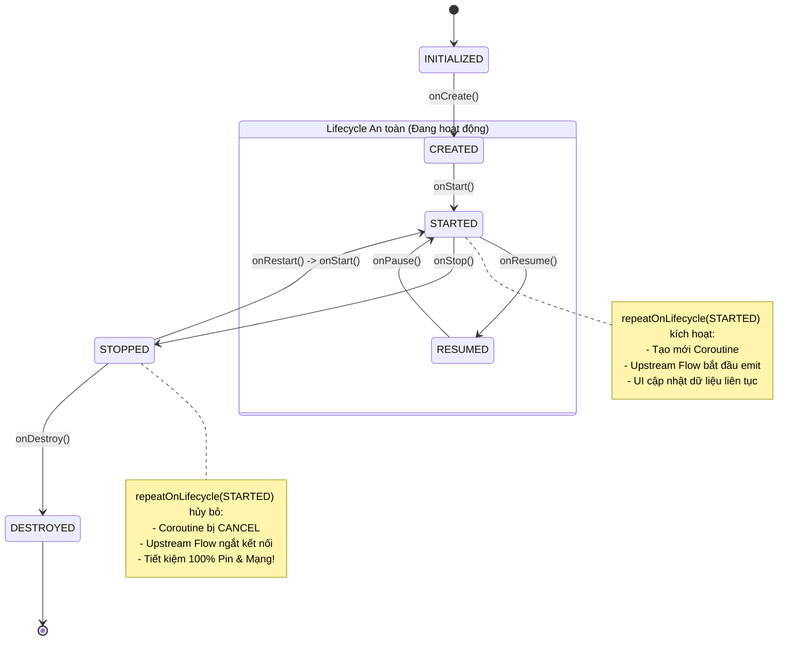

# Bài 05 — Thu thập Flow theo Vòng đời Android (Lifecycle-Aware Flow Collection)

> **Tài liệu tham chiếu gốc:** [A safer way to collect flows from Android UIs — Android Developers Blog & Architecture Guide](https://developer.android.com/topic/libraries/architecture/coroutines#lifecycle-aware)  
> **Áp dụng:** Kotlin 2.0+, `lifecycle-runtime-ktx:2.8.7`, `lifecycle-runtime-compose:2.8.7`  
> **Mục tiêu:** Hiểu rõ mối nguy hiểm khi thu thập Flow thiếu nhận biết vòng đời (lãng phí pin, mạng, crash UI); phân tích lý do `launchWhenStarted` bị khai tử (deprecated); làm chủ `repeatOnLifecycle` trong View System; và sử dụng chuẩn mực `collectAsStateWithLifecycle()` trong Jetpack Compose hiện đại.

---

## 1. Vấn đề: Thu thập Flow ở Chế độ Nền (Background)

Khi người dùng chuyển sang ứng dụng khác hoặc nhấn nút Home, Activity của bạn sẽ chuyển sang trạng thái dừng (`STOPPED`).

Nếu bạn thu thập dữ liệu từ một Flow bên trong một coroutine thông thường (`lifecycleScope.launch`), coroutine này **vẫn tiếp tục chạy ngầm trong background**:
- **Lãng phí pin và tài nguyên mạng:** Nếu Flow đó liên tục lắng nghe tọa độ GPS phần cứng, cập nhật tin nhắn WebSocket hoặc polling dữ liệu từ máy chủ, thiết bị vẫn sẽ tiêu hao năng lượng và băng thông vô ích dù người dùng không hề nhìn thấy màn hình.
- **Rủi ro Crash ứng dụng:** Việc cố gắng cập nhật các phần tử UI khi Activity không còn hiển thị có thể dẫn đến các lỗi xung đột trạng thái nghiêm trọng.

```
Mối đe dọa khi thiếu nhận biết vòng đời:
App Foreground (onStart) ──► App Background (onStop) ──► App Foreground (onStart)
UI đang xem                   Người dùng ra Home         Người dùng quay lại app
      │                              │                             │
[Flow vẫn collect ngầm] ────► [VẪN TIẾP TỤC COLLECT!] ──────► [Collect tiếp...]
                              (Lãng phí PIN & Băng thông 4G!)
```

---

## 2. Lịch sử Tiến hóa: Tại sao `launchWhenStarted` bị Khai tử (Deprecated)?

Trước đây, thư viện AndroidX cung cấp các API như `lifecycleScope.launchWhenStarted` hoặc `launchWhenResumed`. Tuy nhiên, Google đã chính thức **đánh dấu không khuyến khích (deprecated)** các hàm này vì cơ chế hoạt động nguy hiểm của chúng:

> [!WARNING]
> **Hạn chế chết người của `launchWhenStarted`:**  
> `launchWhenStarted` chỉ **tạm dừng (suspend)** việc thực thi khối mã coroutine khi Activity vào trạng thái `STOPPED`.  
> Nó **KHÔNG hề hủy bỏ (cancel) luồng sản xuất upstream**! Nhà sản xuất (Flow producer) bên dưới vẫn tiếp tục phát dữ liệu và tích tụ dữ liệu đó trong bộ đệm ngầm trên RAM, gây tốn pin và rò rỉ tài nguyên.

---

## 3. Giải pháp Chuẩn mực: API `repeatOnLifecycle`

Để khắc phục triệt để vấn đề trên, Google giới thiệu hàm mở rộng `repeatOnLifecycle`:

```kotlin
suspend fun LifecycleOwner.repeatOnLifecycle(
    state: Lifecycle.State,
    block: suspend CoroutineScope.() -> Unit
)
```

### Cơ chế hoạt động:
1. `repeatOnLifecycle` là một hàm tạm dừng (`suspend function`).
2. Khi vòng đời của `LifecycleOwner` đạt trạng thái tối thiểu được chỉ định (thường là `Lifecycle.State.STARTED`), nó sẽ **tự động khởi chạy một coroutine mới** và thực thi khối mã `block`.
3. Khi vòng đời rơi xuống dưới trạng thái đó (ví dụ: Activity bị ẩn xuống `STOPPED`), coroutine này **sẽ bị hủy bỏ ngay lập tức (cancelled)**, kéo theo việc hủy bỏ toàn bộ chuỗi sản xuất Flow ở upstream.
4. Khi ứng dụng quay lại foreground (`STARTED`), nó sẽ **tự động khởi chạy lại coroutine mới** và bắt đầu thu thập lại dữ liệu mới nhất.

---

## 4. Thu thập Flow trong View System (Activity & Fragment)

### 4.1. Trong `Activity`

```kotlin
class MyActivity : AppCompatActivity() {

    private val viewModel: MyViewModel by viewModels()

    override fun onCreate(savedInstanceState: Bundle?) {
        super.onCreate(savedInstanceState)
        setContentView(R.layout.activity_my)

        // Khởi chạy coroutine trong lifecycleScope của Activity
        lifecycleScope.launch {
            // Tự động start khi Activity đạt STARTED, cancel khi xuống STOPPED
            repeatOnLifecycle(Lifecycle.State.STARTED) {
                viewModel.uiState.collect { state ->
                    renderUi(state)
                }
            }
        }
    }
}
```

---

### 4.2. Trong `Fragment` (Lưu ý Vòng đời View)

> [!CAUTION]
> **Quy tắc bắt buộc trong Fragment:**  
> Luôn sử dụng `viewLifecycleOwner` thay vì `this` hoặc `lifecycleScope` của Fragment!  
> Trong Fragment, vòng đời của Fragment có thể tồn tại lâu hơn vòng đời View của nó. Sử dụng sai lifecycle sẽ gây ra lỗi rò rỉ bộ nhớ và crash khi Fragment được đưa vào BackStack.

```kotlin
class MyFragment : Fragment(R.layout.fragment_my) {

    private val viewModel: MyViewModel by viewModels()

    override fun onViewCreated(view: View, savedInstanceState: Bundle?) {
        super.onViewCreated(view, savedInstanceState)

        // Sử dụng viewLifecycleOwner để đồng bộ chính xác với giao diện
        viewLifecycleOwner.lifecycleScope.launch {
            viewLifecycleOwner.repeatOnLifecycle(Lifecycle.State.STARTED) {
                viewModel.uiState.collect { state ->
                    updateView(state)
                }
            }
        }
    }
}
```

---

### 4.3. Toán tử mở rộng `flowWithLifecycle`
Nếu bạn chỉ muốn thu thập một Flow duy nhất một cách ngắn gọn, bạn có thể dùng toán tử `flowWithLifecycle`:

```kotlin
lifecycleScope.launch {
    viewModel.uiState
        .flowWithLifecycle(lifecycle, Lifecycle.State.STARTED)
        .collect { state ->
            renderUi(state)
        }
}
```

---

## 5. Thu thập Flow trong Jetpack Compose Hiện đại

Trong Jetpack Compose, việc thu thập StateFlow thường được thực hiện qua các hàm mở rộng State.

### 5.1. So sánh `collectAsState()` vs `collectAsStateWithLifecycle()`

| Tiêu chí | `collectAsState()` | `collectAsStateWithLifecycle()` |
| :--- | :--- | :--- |
| **Thư viện** | `androidx.compose.runtime` | `androidx.lifecycle.compose` (`lifecycle-runtime-compose`) |
| **Nhận biết Vòng đời** | ❌ Chỉ gắn với vòng đời Composition của Compose | ✅ Gắn chặt với `Lifecycle.State` của Android (mặc định là `STARTED`) |
| **Hành vi ở Background** | Vẫn tiếp tục thu thập luồng dù app đã bị ẩn ra ngoài | Tự động ngắt kết nối và giải phóng upstream khi app ở background |
| **Khuyến nghị từ Google** | Chỉ dùng cho mã thuần Compose đa nền tảng (KMP Desktop) | **Tiêu chuẩn vàng bắt buộc cho mọi ứng dụng Android** |

---

### 5.2. Triển khai Chuẩn trong Composable Screen:

Thêm dependency vào `build.gradle.kts`:
```kotlin
implementation("androidx.lifecycle:lifecycle-runtime-compose:2.8.7")
```

Sử dụng trong mã Compose:

```kotlin
@Composable
fun UserProfileScreen(
    viewModel: UserProfileViewModel = viewModel()
) {
    // Thu thập an toàn tuyệt đối theo vòng đời Android
    val uiState by viewModel.uiState.collectAsStateWithLifecycle()

    when (val state = uiState) {
        is UserProfileUiState.Loading -> {
            LoadingSpinner()
        }
        is UserProfileUiState.Success -> {
            ProfileContent(user = state.user)
        }
        is UserProfileUiState.Error -> {
            ErrorMessage(message = state.message)
        }
    }
}
```

---

## 6. Sơ đồ Vận hành Toàn cảnh theo Vòng đời



---

## 7. Tổng kết 3 Nguyên Tắc Cốt Lõi cho Android UI

1. **Không bao giờ dùng `lifecycleScope.launch` thuần túy để collect Flow trên giao diện** mà không có cơ chế chặn theo trạng thái vòng đời.
2. **Trong View System (Activity/Fragment):** Luôn dùng `repeatOnLifecycle(Lifecycle.State.STARTED)` (và luôn dùng `viewLifecycleOwner` trong Fragment).
3. **Trong Jetpack Compose:** Luôn sử dụng `collectAsStateWithLifecycle()` thay vì `collectAsState()`.
