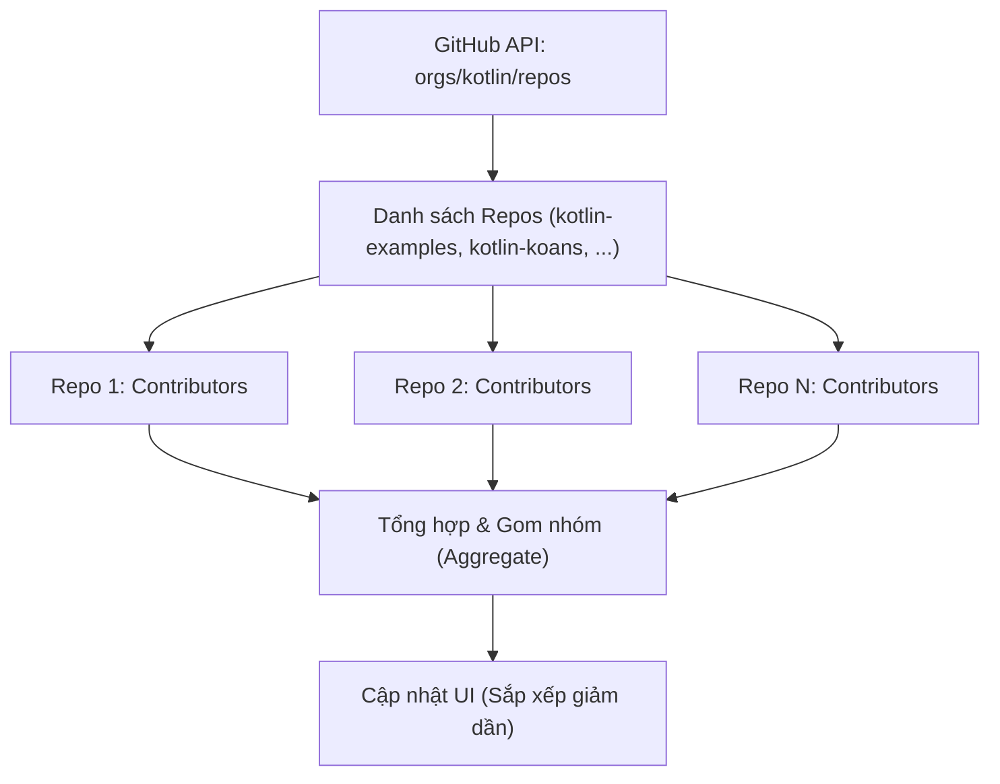

# Bài 12 — Dự án Thực hành: GitHub Contributors & Channels (Hands-on Tutorial)

> **Tài liệu gốc:** [Coroutines and channels − tutorial — Kotlin Documentation](https://kotlinlang.org/docs/coroutines-and-channels.html)  
> **Thư viện áp dụng:** `kotlinx.coroutines:1.11.0`, `Retrofit:2.x`  
> **Mục tiêu:** Áp dụng toàn bộ kiến thức lý thuyết từ Bài 01 đến Bài 11 vào một dự án thực tế: Xây dựng ứng dụng tải và phân tích danh sách cộng tác viên (Contributors) của một tổ chức GitHub; so sánh trực quan hiệu năng và kiến trúc giữa 5 giải pháp: **Blocking** $\rightarrow$ **Background Thread** $\rightarrow$ **Callbacks** $\rightarrow$ **Suspending Functions** $\rightarrow$ **Channels**; xử lý hủy bỏ tác vụ (Cancellation); và viết Unit Test với thời gian ảo (`runTest`).

---

## 1. Bối cảnh & Yêu cầu Bài toán (Project Overview)

Trong dự án này, chúng ta cần xây dựng một ứng dụng tải về danh sách tất cả những người đóng góp (contributors) cho toàn bộ các kho lưu trữ (repositories) thuộc về một tổ chức trên GitHub (mặc định là `"kotlin"`).

Quy trình nghiệp vụ bao gồm 3 bước:
1. Gọi API GitHub lấy danh sách tất cả repositories của tổ chức (`GET /orgs/{org}/repos`).
2. Với mỗi repository, gọi tiếp API lấy danh sách contributors (`GET /repos/{owner}/{repo}/contributors`).
3. Tổng hợp dữ liệu: Một người có thể đóng góp cho nhiều repo khác nhau $\rightarrow$ gom nhóm theo tên (login), cộng dồn tổng số lượt đóng góp (contributions), sắp xếp giảm dần và hiển thị lên giao diện UI.



---

## 2. Mô hình API: Retrofit Service

Chúng ta định nghĩa giao diện `GitHubService` bằng thư viện Retrofit:

```kotlin
import retrofit2.Call
import retrofit2.http.GET
import retrofit2.http.Path

data class Repo(val name: String)
data class User(val login: String, val contributions: Int)
data class RequestData(val username: String, val token: String, val org: String)

interface GitHubService {
    @GET("orgs/{org}/repos?per_page=100")
    fun getOrgReposCall(
        @Path("org") org: String
    ): Call<List<Repo>>

    @GET("repos/{owner}/{repo}/contributors?per_page=100")
    fun getRepoContributorsCall(
        @Path("owner") owner: String,
        @Path("repo") repo: String
    ): Call<List<User>>
}
```

Hàm mở rộng hỗ trợ lấy body an toàn:
```kotlin
import retrofit2.Response

fun <T> Response<List<T>>.bodyList(): List<T> {
    return body() ?: emptyList()
}
```

---

## 3. Task 1: Thuật toán Gom nhóm Dữ liệu (`aggregate`)

Một cộng tác viên có thể xuất hiện nhiều lần trong danh sách nếu họ tham gia nhiều repository. Chúng ta cần viết hàm `aggregate()` gom nhóm theo `login`, tính tổng `contributions` và sắp xếp giảm dần.

### Lời giải Chuẩn (Solution for Task 1):
```kotlin
fun List<User>.aggregate(): List<User> =
    groupBy { it.login }
        .map { (login, group) -> User(login, group.sumOf { it.contributions }) }
        .sortedByDescending { it.contributions }
```

> [!TIP]
> Bạn cũng có thể dùng `groupingBy { it.login }.fold(...)` để tránh tạo danh sách trung gian nhằm tối ưu hóa bộ nhớ heap.

---

## 4. Cách tiếp cận 1: Blocking UI Thread (Cách làm Sai lầm)

Mã nguồn thực thi đồng bộ truyền thống:

```kotlin
fun loadContributorsBlocking(
    service: GitHubService,
    req: RequestData
): List<User> {
    val repos = service
        .getOrgReposCall(req.org)   // #1 Tạo Call
        .execute()                  // #2 Lệnh gọi đồng bộ chặn thread!
        .bodyList()

    return repos.flatMap { repo ->
        service
            .getRepoContributorsCall(req.org, repo.name)
            .execute()              // # Chặn thread cho từng repo!
            .bodyList()
    }.aggregate()
}
```

### Hiện tượng:
Khi bấm nút **Load contributors**:
- Toàn bộ cửa sổ UI bị **đóng băng hoàn toàn (freeze)**, không thể kéo thả hay click chuột.
- Lý do: Hàm `execute()` chặn đứng **UI Event Dispatch Thread (EDT / Main Thread)** trong nhiều giây cho tới khi toàn bộ hàng chục request HTTP hoàn thành.

---

## 5. Cách tiếp cận 2: Đẩy sang Background Thread (Task 2)

Giải pháp sơ khai nhất để giải phóng Main Thread là mở một Thread riêng:

```kotlin
import kotlin.concurrent.thread
import javax.swing.SwingUtilities

fun loadContributorsBackground(
    service: GitHubService,
    req: RequestData,
    updateResults: (List<User>) -> Unit
) {
    thread {
        val users = loadContributorsBlocking(service, req)
        // Bắt buộc phải chuyển ngược về UI thread khi cập nhật giao diện!
        SwingUtilities.invokeLater {
            updateResults(users)
        }
    }
}
```

### Nhược điểm:
1. **Lãng phí tài nguyên**: Thread của hệ điều hành rất đắt đỏ (chiếm ~1MB - 2MB bộ nhớ stack).
2. **Vẫn chạy tuần tự**: Các request cho từng repository vẫn được gửi nối tiếp nhau (repo 1 xong mới tới repo 2), tổng thời gian tải vẫn rất lâu.

---

## 6. Cách tiếp cận 3: Callbacks & Hiểm họa Bất đồng bộ (Task 3)

Để các request chạy đồng thời không tuần tự, ta sử dụng API bất đồng bộ `Call.enqueue()` của Retrofit.

### Cạm bẫy 1: Cập nhật sớm khi danh sách còn rỗng
```kotlin
// ❌ SAI LẦM 1:
fun loadContributorsCallbacks(service: GitHubService, req: RequestData, updateResults: (List<User>) -> Unit) {
    service.getOrgReposCall(req.org).enqueue(object : Callback<List<Repo>> {
        override fun onResponse(call: Call<List<Repo>>, response: Response<List<Repo>>) {
            val repos = response.bodyList()
            val allUsers = mutableListOf<User>()
            for (repo in repos) {
                service.getRepoContributorsCall(req.org, repo.name).enqueue(object : Callback<List<User>> {
                    override fun onResponse(call: Call<List<User>>, response: Response<List<User>>) {
                        allUsers += response.bodyList()
                    }
                    override fun onFailure(call: Call<List<User>>, t: Throwable) {}
                })
            }
            // ❌ LỖI: Chạy ngay khi các enqueue vừa được kích hoạt, allUsers vẫn đang rỗng!
            updateResults(allUsers.aggregate())
        }
        override fun onFailure(call: Call<List<Repo>>, t: Throwable) {}
    })
}
```

### Cạm bẫy 2: So sánh Index cuối cùng (`index == repos.lastIndex`)
Nhiều lập trình viên sửa bằng cách kiểm tra: *"Nếu đang ở index cuối cùng thì gọi updateResults"*.
> [!CAUTION]
> **Đây là lỗi Race Condition cực kỳ nguy hiểm!**  
> Do các request chạy đồng thời trên mạng, repo cuối cùng có thể trả về kết quả **nhanh hơn** repo số 1 hoặc repo số 2. Nếu repo cuối về trước, bạn sẽ bỏ sót toàn bộ dữ liệu của các repo phản hồi chậm!

### Lời giải Chuẩn cho Callbacks (Sử dụng `AtomicInteger` & Danh sách Đồng bộ):
```kotlin
import java.util.Collections
import java.util.concurrent.atomic.AtomicInteger

fun loadContributorsCallbacks(
    service: GitHubService,
    req: RequestData,
    updateResults: (List<User>) -> Unit
) {
    service.getOrgReposCall(req.org).enqueue(object : Callback<List<Repo>> {
        override fun onResponse(call: Call<List<Repo>>, response: Response<List<Repo>>) {
            val repos = response.bodyList()
            val allUsers = Collections.synchronizedList(mutableListOf<User>())
            val numberOfProcessed = AtomicInteger()

            for (repo in repos) {
                service.getRepoContributorsCall(req.org, repo.name).enqueue(object : Callback<List<User>> {
                    override fun onResponse(call: Call<List<User>>, response: Response<List<User>>) {
                        allUsers += response.bodyList()
                        // Đảm bảo mọi repo đều đã hoàn tất phản hồi:
                        if (numberOfProcessed.incrementAndGet() == repos.size) {
                            updateResults(allUsers.aggregate())
                        }
                    }
                    override fun onFailure(call: Call<List<User>>, t: Throwable) {
                        if (numberOfProcessed.incrementAndGet() == repos.size) {
                            updateResults(allUsers.aggregate())
                        }
                    }
                })
            }
        }
        override fun onFailure(call: Call<List<Repo>>, t: Throwable) {}
    })
}
```

> [!WARNING]
> **Hiện tượng Địa ngục Callback (Callback Hell):**  
> Mã nguồn trở nên rối rắm, lồng ghép nhiều tầng, khó quản lý lỗi và phải dùng đến các biến atomic phức tạp để đồng bộ dữ liệu.

---

## 7. Cách tiếp cận 4: Hàm Tạm Ngưng (Suspending Functions - Task 4)

Retrofit hỗ trợ trực tiếp hàm `suspend`:

```kotlin
interface GitHubService {
    @GET("orgs/{org}/repos?per_page=100")
    suspend fun getOrgRepos(
        @Path("org") org: String
    ): Response<List<Repo>>

    @GET("repos/{owner}/{repo}/contributors?per_page=100")
    suspend fun getRepoContributors(
        @Path("owner") owner: String,
        @Path("repo") repo: String
    ): Response<List<User>>
}
```

Triển khai với cú pháp tuần tự rõ ràng:

```kotlin
suspend fun loadContributorsSuspend(
    service: GitHubService,
    req: RequestData
): List<User> {
    val repos = service.getOrgRepos(req.org).bodyList()

    return repos.flatMap { repo ->
        service.getRepoContributors(req.org, repo.name).bodyList()
    }.aggregate()
}
```

> [!NOTE]
> Mã nguồn trông hệt như mã blocking ở Cách 1, nhưng **hoàn toàn phi ngăn chặn (non-blocking)**! Giao diện UI vẫn mượt mà 100%, không cần một callback hay biến atomic nào.

---

## 8. Cách tiếp cận 5: Tải Song song Đồng thời với `async` (Task 5)

Hàm ở Task 4 vẫn tải tuần tự từng repo. Để tối đa hóa tốc độ đường truyền, chúng ta sử dụng `async` để khởi chạy đồng thời các request lấy contributors:

```kotlin
import kotlinx.coroutines.*

suspend fun loadContributorsConcurrent(
    service: GitHubService,
    req: RequestData
): List<User> = coroutineScope {
    val repos = service.getOrgRepos(req.org).bodyList()

    // Khởi chạy song song việc tải contributors cho từng repo:
    val deferredUsers: List<Deferred<List<User>>> = repos.map { repo ->
        async {
            service.getRepoContributors(req.org, repo.name).bodyList()
        }
    }

    // Chờ tất cả hoàn thành và gộp kết quả:
    deferredUsers.awaitAll().flatten().aggregate()
}
```

### So sánh Hiệu năng Thực tế:
- **Tải tuần tự (`loadContributorsSuspend`)**: ~ 15.000 ms (15 giây cho 40 repos).
- **Tải song song (`loadContributorsConcurrent`)**: ~ 1.200 ms (1.2 giây)! **Nhanh hơn gấp 12 lần!**

---

## 9. Đồng thời Có cấu trúc & Xử lý Hủy bỏ (Structured Concurrency & Cancellation)

### 9.1 Cơ chế Hủy tác vụ Tự động
Nhờ bọc toàn bộ mã trong builder **`coroutineScope`**, chúng ta nhận được tính năng **Structured Concurrency**:
1. Nếu một request tải repository bị lỗi mạng nghiêm trọng, toàn bộ các tác vụ con khác trong scope sẽ tự động bị hủy để tiết kiệm băng thông và tài nguyên.
2. Khi người dùng bấm nút **Cancel** trên giao diện:
   ```kotlin
   // launch trả về đối tượng Job đại diện cho coroutine tải dữ liệu
   val loadingJob = launch {
       val users = loadContributorsConcurrent(service, req)
       updateResults(users, startTime)
   }

   // Lắng nghe sự kiện click nút Cancel
   val listener = ActionListener {
       loadingJob.cancel() // Hủy coroutine cha -> tự động lan truyền hủy tất cả network calls con!
       updateLoadingStatus(CANCELED)
   }
   addCancelListener(listener)
   ```

### 9.2 Kế thừa Ngữ cảnh từ Outer Scope
Một coroutine scope mới được tạo bởi `coroutineScope` hoặc các builder con luôn tự động **kế thừa context (bao gồm Dispatcher)** từ scope bên ngoài:
```kotlin
launch(Dispatchers.Default) { // Scope cha bên ngoài dùng Dispatchers.Default
    val users = loadContributorsConcurrent(service, req)
    // Toàn bộ các async {} bên trong loadContributorsConcurrent 
    // sẽ tự động chạy trên Dispatchers.Default mà không cần chỉ định lại!
}
```

> [!TIP]
> Trong các ứng dụng UI (Android, Desktop), thông lệ chuẩn là khởi tạo top-level coroutine với `Dispatchers.Main`, sau đó chuyển sang `Dispatchers.IO` hoặc `Dispatchers.Default` khi cần thực hiện tác vụ nặng.

---

## 10. Task 6: Hiển thị Tiến độ Từng bước Tuần tự (Showing Progress)

Mặc dù giải pháp Concurrent (Task 5) chạy rất nhanh (~1.2s), nhưng người dùng vẫn phải nhìn biểu tượng loading quay cho đến khi repo cuối cùng tải xong mới thấy danh sách xuất hiện.

Ở **Task 6**, chúng ta xây dựng cơ chế hiển thị tiến độ trung gian: **Cứ tải xong một repo, lập tức tổng hợp dữ liệu và cập nhật ngay lên giao diện UI** (theo cách tuần tự):

```kotlin
// src/tasks/Request6Progress.kt
suspend fun loadContributorsProgress(
    service: GitHubService,
    req: RequestData,
    updateResults: suspend (List<User>, completed: Boolean) -> Unit
) {
    val repos = service
        .getOrgRepos(req.org)
        .also { logRepos(req, it) }
        .bodyList()

    var allUsers = emptyList<User>()
    for ((index, repo) in repos.withIndex()) {
        val users = service.getRepoContributors(req.org, repo.name)
            .also { logUsers(repo, it) }
            .bodyList()

        // Cộng dồn danh sách và gom nhóm (aggregate) lại
        allUsers = (allUsers + users).aggregate()
        
        // Gọi callback cập nhật UI trên Main thread sau mỗi repo
        updateResults(allUsers, index == repos.lastIndex)
    }
}
```

Tại nơi gọi trong `Contributors.kt`:
```kotlin
launch(Dispatchers.Default) {
    loadContributorsProgress(service, req) { users, completed ->
        withContext(Dispatchers.Main) { // Chuyển sang Main thread để vẽ UI
            updateResults(users, startTime, completed)
        }
    }
}
```

> [!NOTE]
> Giải pháp này cập nhật tiến độ rất mượt, nhưng vì tải **tuần tự (sequential)** nên tổng thời gian tải vẫn lâu (~15 giây). Để vừa **tải song song cực nhanh**, vừa **hiển thị tiến độ liên tục**, chúng ta cần kết hợp Concurrency với **Channel** trong Task 7!

---

## 11. Task 7: Đồng thời Kết hợp Hiển thị Tiến độ bằng Channel (Channels)

### 11.1 Các Loại Channel trong Coroutines
Channel là cơ chế giao tiếp an toàn giữa các coroutine ("Chia sẻ dữ liệu bằng cách truyền tin, không dùng chung vùng nhớ"):
- **Rendezvous Channel** (mặc định, `Channel()`): Dung lượng bộ đệm bằng 0. Bên gửi (`send()`) sẽ bị treo (suspend) cho tới khi bên nhận (`receive()`) sẵn sàng nhận, và ngược lại.
- **Buffered Channel** (`Channel(capacity)`): Có hàng đợi đệm với kích thước giới hạn cố định.
- **Unlimited Channel** (`Channel(UNLIMITED)`): Hàng đợi vô hạn dựa trên danh sách liên kết. `send()` không bao giờ suspend (có thể gây OOM nếu không kiểm soát).
- **Conflated Channel** (`Channel(CONFLATED)`): Luôn chỉ giữ lại 1 phần tử mới nhất, ghi đè các phần tử cũ.

### 11.2 Lời giải Task 7: Tải Song Song & Cập nhật UI qua Channel
Mỗi repo được tải trong một coroutine con độc lập (`launch`). Ngay khi repo đó tải xong, nó đẩy kết quả vào `Channel`. Ở đầu bên kia, coroutine nhận tuần tự đọc từ channel, gom nhóm và cập nhật UI:

```kotlin
// src/tasks/Request7Channels.kt
suspend fun loadContributorsChannels(
    service: GitHubService,
    req: RequestData,
    updateResults: suspend (List<User>, completed: Boolean) -> Unit
) = coroutineScope {

    val repos = service
        .getOrgRepos(req.org)
        .also { logRepos(req, it) }
        .bodyList()

    // Khởi tạo kênh truyền tin trung gian
    val channel = Channel<List<User>>()

    // Khởi chạy song song việc tải contributors cho từng repo
    for (repo in repos) {
        launch {
            val users = service.getRepoContributors(req.org, repo.name)
                .also { logUsers(repo, it) }
                .bodyList()
            channel.send(users) // Gửi vào channel ngay khi xong
        }
    }

    // Nhận tuần tự từng kết quả trả về từ channel
    var allUsers = emptyList<User>()
    repeat(repos.size) { index ->
        val users = channel.receive() // Treo nếu chưa có repo nào xong
        allUsers = (allUsers + users).aggregate()
        
        // Cập nhật UI ngay lập tức với dữ liệu trung gian:
        updateResults(allUsers, index == repos.lastIndex)
    }
}
```

```
[UI / Consumer Loop] <--- (receive() tuần tự) <--- [Channel] <=== Repo 1 Worker (launch)
                                                             <=== Repo 2 Worker (launch)
                                                             <=== Repo N Worker (launch)
```

> [!TIP]
> **Ưu điểm vượt trội của Channel ở Task 7:**
> 1. **Tốc độ tối đa**: Tất cả 40 repos được gửi request đồng thời trên mạng.
> 2. **Phản hồi tức thì**: Bất kể repo nào về trước, dữ liệu của repo đó được render lên UI ngay lập tức.
> 3. **Loại bỏ Race Condition hoàn toàn**: Biến `allUsers` chỉ được đọc và ghi bởi một coroutine duy nhất ở vòng lặp `receive()`, không cần bất kỳ `AtomicInteger`, `synchronized`, hay lock nào!

---

## 12. Task 8: Kiểm Thử Coroutines với Thời Gian Ảo (`runTest`)

### 12.1 Thách thức khi Test Thời Gian Thực
Nếu kiểm thử với service giả lập có delay thực tế:
- Request repos: delay 1000 ms
- Repo 1: delay 1000 ms
- Repo 2: delay 1200 ms
- Repo 3: delay 800 ms
- Chạy tuần tự (`loadContributorsSuspend`): Tốn $1000 + (1000 + 1200 + 800) = \mathbf{4000\text{ ms}}$ (4 giây).
- Chạy song song (`loadContributorsConcurrent`): Tốn $1000 + \max(1000, 1200, 800) = \mathbf{2200\text{ ms}}$ (2.2 giây).

Nếu chạy với thời gian thực, bộ test suite mất hàng chục giây và dễ bị chập chờn (flaky) do phụ thuộc vào tải của CPU.

### 12.2 Giải pháp với Thời Gian Ảo (`runTest` & `TestScope`)
Builder `runTest` sử dụng bộ điều phối ảo (`StandardTestDispatcher`). Khi gặp lệnh `delay()`, nó **tự động tua nhanh thời gian ảo (virtual time)** mà không làm luồng thực tế phải ngủ:

```kotlin
import kotlinx.coroutines.ExperimentalCoroutinesApi
import kotlinx.coroutines.test.runTest
import kotlinx.coroutines.test.currentTime
import org.junit.Assert.assertEquals
import org.junit.Test

@OptIn(ExperimentalCoroutinesApi::class)
class ContributorsTest {

    @Test
    fun testConcurrent() = runTest {
        val startTime = currentTime
        val result = loadContributorsConcurrent(MockGithubService, testRequestData)
        
        // Kiểm tra kết quả dữ liệu
        assertEquals(expectedConcurrentResults.users, result)
        
        val totalTime = currentTime - startTime
        // Thời gian ảo chính xác là 2200 ms dù test chỉ chạy mất vài mili-giây trên CPU!
        assertEquals(
            "Các request chạy song song nên tổng thời gian ảo phải là 2200 ms: " +
            "1000ms lấy repos + max(1000, 1200, 800) = 1200ms",
            expectedConcurrentResults.timeFromStart, 
            totalTime
        )
    }

    @Test
    fun testChannels() = runTest {
        val startTime = currentTime
        var index = 0
        loadContributorsChannels(MockGithubService, testRequestData) { users, _ ->
            val expected = concurrentProgressResults[index++]
            val time = currentTime - startTime
            
            // Xác thực từng mốc thời gian ảo khi repo hoàn thành (800ms -> 1000ms -> 1200ms)
            assertEquals("Kỳ vọng kết quả trung gian sau ${expected.timeFromStart} ms:", 
                expected.timeFromStart, time)
            assertEquals("Dữ liệu trung gian sai tại mốc $time:", expected.users, users)
        }
    }
}
```

---

## 13. Bảng Tổng Kết So Sánh Toàn Bộ 5 Giải Pháp

| Tiêu chí | Blocking (Task 1) | Background (Task 2) | Callbacks (Task 3) | Suspend Tuần tự (Task 4, 6) | Channels Song song (Task 5, 7) |
| :--- | :--- | :--- | :--- | :--- | :--- |
| **Trạng thái UI** | Đóng băng (Freeze) | Mượt mà | Mượt mà | Mượt mà | **Mượt mà tuyệt đối** |
| **Tốc độ Tải** | Rất chậm (~15s) | Rất chậm (~15s) | Nhanh (~1.2s) | Chậm (~15s) | **Cực nhanh (~1.2s)** |
| **Tiến độ (Progress)** | Không | Không | Phức tạp | Có (chậm) | **Cập nhật tức thì** |
| **Độ phức tạp Code** | Đơn giản | Thấp | **Cực cao (Callback hell)** | Cực kỳ ngắn gọn | Ngắn gọn, sáng sủa |
| **An toàn Đa luồng** | N/A | Dễ lỗi | **Dễ dính Race Condition** | Hoàn toàn an toàn | **An toàn tuyệt đối** |
| **Hỗ trợ Hủy bỏ** | Không thể | Khó khăn | Rất khó | Tự động | **Tự động theo Scope** |
| **Kiểm thử (Testing)** | Khó kiểm soát | Khó khăn | Phức tạp | Hỗ trợ `runTest` | **Dễ dàng với `runTest`** |

